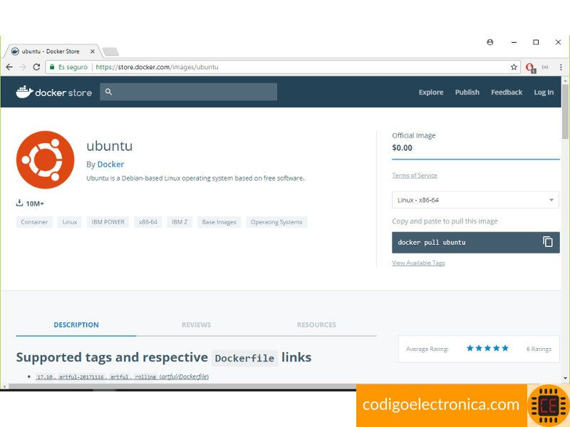

# Comandos básicos
Antes de empezar a trabajar con Docker y usar todo su potencial para nuestros desarrollos y orquestación de aplicaciones, entendamos los comandos básicos que necesitamos.

## Nota importante
en estos momentos estoy trabajando con Windows, bajo la instalación de docker con hyper-v y uso como terminal el bash que nos da git aunque podemos trabajar con la terminal cmd, si trabajas en linux los comandos son los mismo y el resultado es igual.

## Primer comando
Vamos a ejecutar nuestro primer contenedor con docker run y descargaremos el contenedor hello-world, como se observa a continuación.

C:\Users\ce>docker run hello-world
Unable to find image 'hello-world:latest' locally
latest: Pulling from library/hello-world
ca4f61b1923c: Pull complete
Digest: sha256:445b2fe9afea8b4aa0b2f27fe49dd6ad130dfe7a8fd0832be5de99625dad47cd
Status: Downloaded newer image for hello-world:latest

Hello from Docker!
This message shows that your installation appears to be working correctly.

To generate this message, Docker took the following steps:
 1. The Docker client contacted the Docker daemon.
 2. The Docker daemon pulled the "hello-world" image from the Docker Hub.
    (amd64)
 3. The Docker daemon created a new container from that image which runs the
    executable that produces the output you are currently reading.
 4. The Docker daemon streamed that output to the Docker client, which sent it
    to your terminal.

To try something more ambitious, you can run an Ubuntu container with:
 $ docker run -it ubuntu bash

Share images, automate workflows, and more with a free Docker ID:
 https://cloud.docker.com/

For more examples and ideas, visit:
 https://docs.docker.com/engine/userguide/

## Descargar imágenes
¿Dónde están las imágenes de Docker?, principalmente en su sitio oficial donde estan creadas por la comunidad con las aplicaciones necesarias para trabajar con su proyecto.

Por ejemplo descarguemos una imagen ubuntu que usaremos en este post, para ello en el store de Docker la buscamos y en el resultado, como se observa en la siguiente imagen.

Además nos dice que para descargar la imagen a nuestro equipo debemos usar el siguiente comando.

C:\Users\ce>docker pull ubuntu
Using default tag: latest
latest: Pulling from library/ubuntu
50aff78429b1: Pull complete
f6d82e297bce: Pull complete
275abb2c8a6f: Pull complete
9f15a39356d6: Pull complete
fc0342a94c89: Pull complete
Digest: sha256:ec0e4e8bf2c1178e025099eed57c566959bb408c6b478c284c1683bc4298b683
Status: Downloaded newer image for ubuntu:latest

Como se observa nos acaba de descargar una nueva imagen[2], que es la de Ubuntu, con la cual podemos trabajar de ahora en adelante.

## Visualizar imágenes
En el punto anterior creamos nuestro primer contenedor con el comando hello-world y descargamos la imagen de Ubuntu, pero como podemos ver qué imagen descargo, adememos si podemos ver otras imágenes que tengamos[3] para ello Docker nos da el siguiente comando.

C:\Users\ce>docker images
REPOSITORY          TAG                 IMAGE ID                  CREATED             SIZE
hello-world         latest              f2a91732366c        4 weeks ago         1.85kB
ubuntu              latest              00fd29ccc6f1        4 weeks ago         111MB

Nos retorna un listado de las imágenes que hemos descargado o que se han creado a partir de un contenedor (esto lo hablaré más adelante); tenemos la imagen de hello-world y de ubuntu las cuales podemos usar cuantas veces se requiera y en cualquier momento.

## Ejecutar un contenedor
Hasta ahora podemos descargar una imagen y visualizarla. ¿Pero cómo ejecutamos los contenedores y que realicen las tareas que nosotros requerimos para nuestros proyectos?, observemos el siguiente comando.

C:\Users\ce>docker run ubuntu echo "hola codigoelectronica"
hola codigoelectronica

Con esto ejecutamos un contenedor, para ser más exactos el de Ubuntu y nos retornó por terminal el mensaje que mandamos a imprimir. ¿Pero cómo funciona la instrucción run?, una de las más importantes, según la documentación [4] requiere de parámetros de entrada para ejecutar diferentes acciones en el contenedor, veamos unos casos

Para ejecutar un comando tipo Shell por ejemplo la instrucción -efa la escribimos después del nombre del contenedor, esto aplica solo para las imágenes de Ubuntu.

C:\Users\ce>docker run ubuntu ps -efa
UID         PID   PPID  C STIME TTY       TIME CMD
root        1      0       4 02:07 ?      00:00:00 ps -efa

Ahora si queremos entrar e interactuar directamente en la Shell de la imagen de Ubuntu, usaremos las banderas -i -t lo cual ingresará a la terminal de nuestro contenedor.

C:\Users\ce>docker run -it ubuntu bash
root@7dbf8cee5599:/# ls
bin  boot  dev  etc  home  lib  lib64  media  mnt  opt  proc  root  run  sbin  srv  sys  tmp  usr  var
root@7dbf8cee5599:/#

## Visualizar contenedores
Hemos creado varios contenedores y realizado acciones dentro de ellos, pero como se vio en el ciclo de vida de un contenedor, este se ejecuta y se detiene o sigue corriendo indeterminadamente. ¿Cómo podemos saber cuales contenedores ya se ejecutaron y donde están?, presta atención al siguiente comando [5] que permite listar todos los contenedores.

C:\Users\ce>docker ps -a
CONTAINER ID        IMAGE               COMMAND             CREATED             STATUS              PORTS               NAMES
378bca30421d        ubuntu              "echo 'hola codigo..."   30 seconds ago      Exited (0) 27 seconds ago                       practical_albattani
4e79a75999bd        hello-world         "/hello"                 22 hours ago        Exited (0) 22 hours ago

La información que nos retorna son los siguientes datos: el identificador del contenedor, la imagen con la que se creo el contenedor, el comando que esta ejecutando, hace cuanto fue creado, el estado del contenedor y puerto de conexión si se esta usando.

## Vincularse a un contenedor
Ya listamos los contenedores y observamos los que están en modo ejecución (run). Si queremos ingresar por bash a un contenedor existente usamos el comando run, lo que va a hacer es crear un nuevo contenedor, Docker nos proporciona una serie de instrucciones para ingresar a un contenedor la cuales son attach[6] y exec [7], veamos unos ejemplos.

Creemos un contenedor interactivo de la siguiente forma

C:\Users\ce>docker run -it ubuntu bash
root@f19fff3e4ce8:/#
C:\Users\ce>docker ps
CONTAINER ID        IMAGE               COMMAND             CREATED             STATUS              PORTS               NAMES
f19fff3e4ce8        ubuntu              "bash"              13 seconds ago      Up 10 seconds

Si queremos ingresar al contenedor

C:\Users\ce>docker attach f19f
root@f19fff3e4ce8:/#
root@f19fff3e4ce8:/#

C:\Users\ce>docker run -it ubuntu bash
root@f307af60906d:/#
C:\Users\ce>docker ps
CONTAINER ID        IMAGE               COMMAND             CREATED             STATUS              PORTS               NAMES
f307af60906d        ubuntu              "bash"              14 seconds ago      Up 12 seconds                           practical_lumiere

C:\Users\ce>docker exec -it f307 bash
root@f307af60906d:/#

## Eliminar un contenedor
Por último si queremos eliminar[8] un contenedor por alguna razón, podemos usar la siguiente instrucción en donde solo le pasamos el identificador del contenedor.

C:\Users\ce>docker rm eebcda67f39f
eebcda67f39f