# Instalcion de docker compose

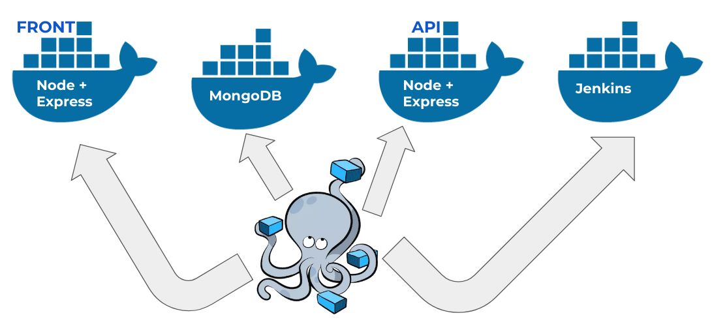

## Paso 1.

Lo primero que hacemos para instalar docker compose es verificar que tengamos los requerimientos necesarios para que nuestra maquina pueda ejecutar sin problemas __docker compose__

Luego de que hayamos verificado procedemos a Google y buscamos el programa en la pagina oficial de docker compose y le damos click en descargar

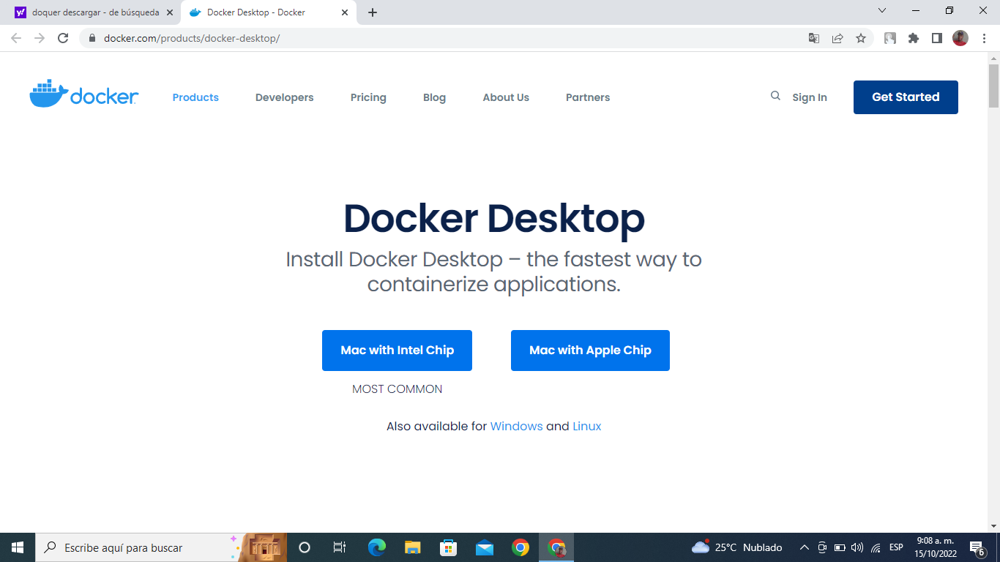

## paso 2.

Luego de que hayan completado con exito la descarga procedemos a inslatar nuestro docker en el equipo de trabajo 

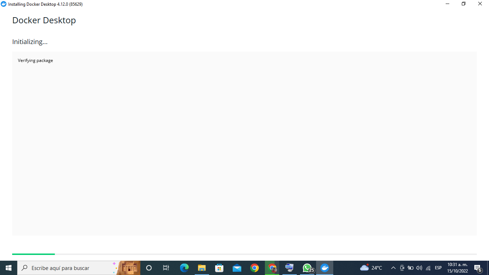

- En este momento empieza el unpacking file de Docker 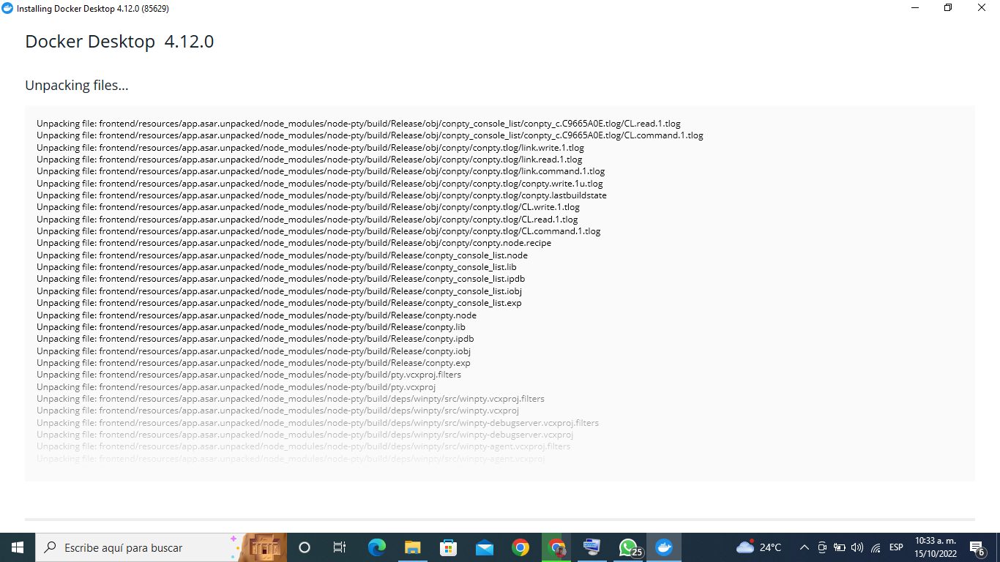

 - instalcion completa.
 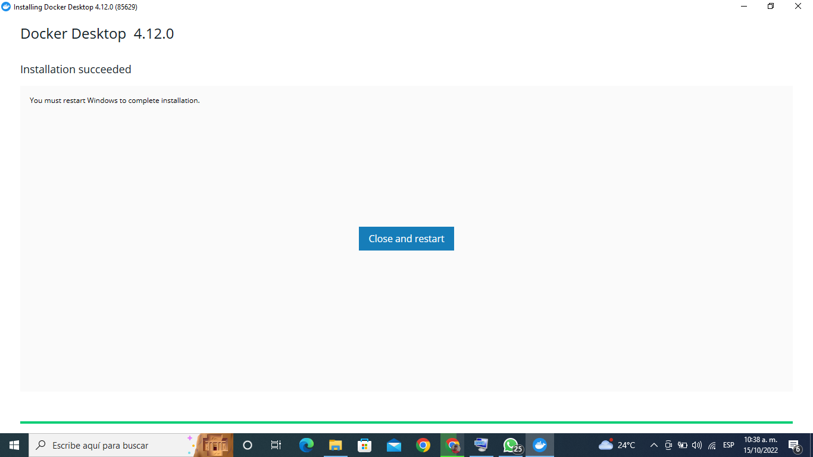

 ## Paso 3.

aqui nos damos cuenta que docker compose quedo instaldo satisfactoriamente 

 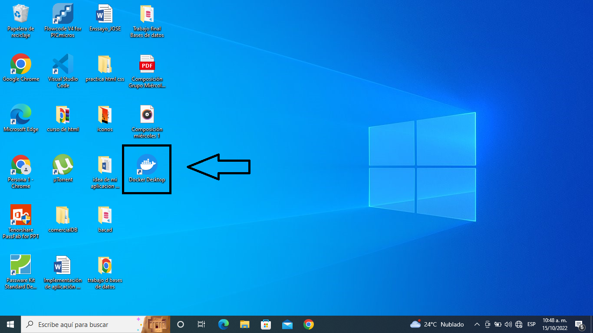

## Paso 4.
 
Procedemos a ejecutar docker para poder iniciar sesion y trabajar en el emulador como se muestran en las imagenes 

 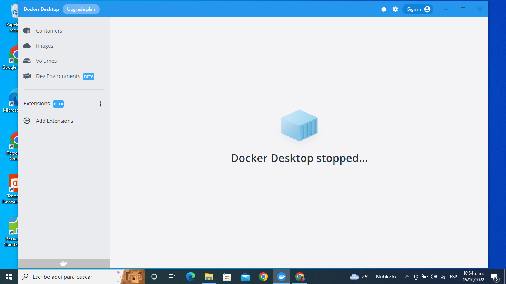
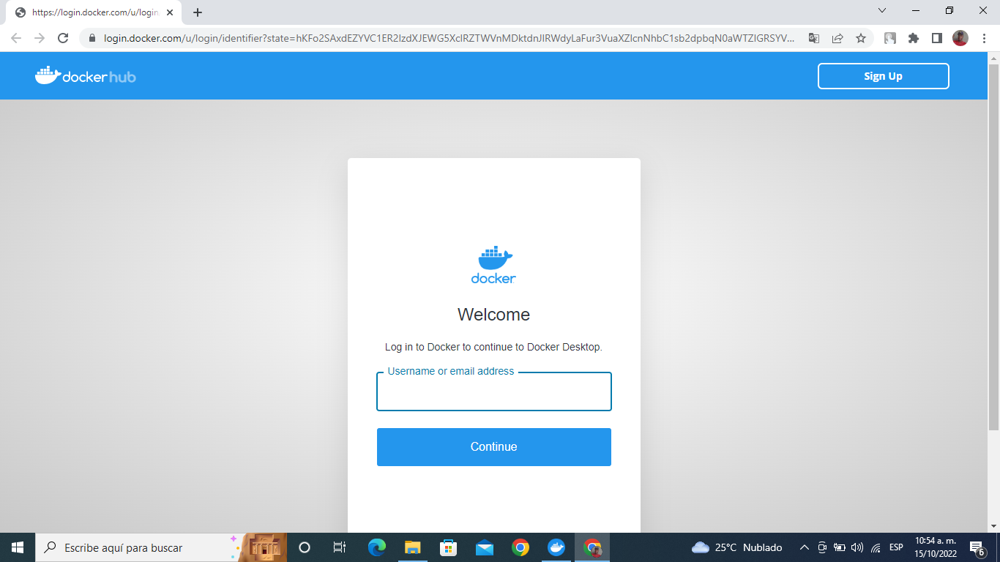
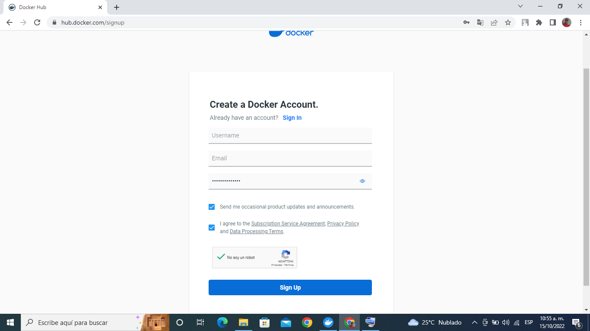

## Paso 5.
 
Luego de que creemos una cuenta en docker procedemos a adquirir el paquete que mas nos beneficie teniendo en cuenta el uso que le demos 

En este tutorial elegiremos la opcion personal.

 

 ## Paso 6.

Despues de que elijamos el plan el cual vamos a trabajar con docker tenemos que verificar nuestra cuenta con un correo de verificacion que docker nos envia todo esto con los datos el cual creamos nuestra cuenta

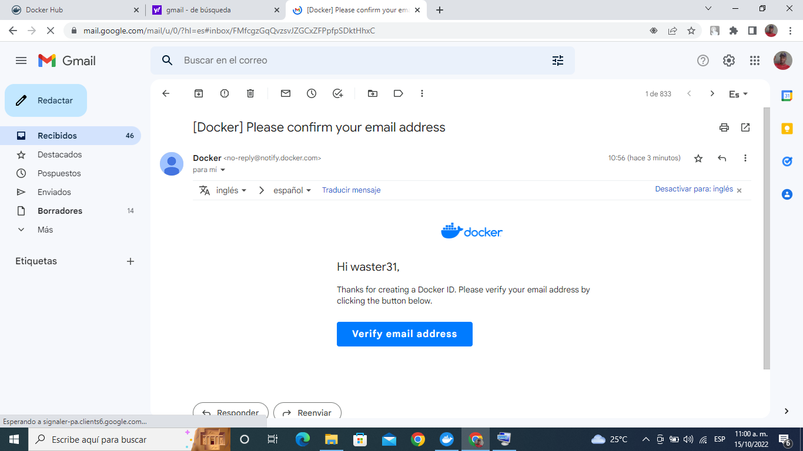

## Paso 7.

Finalmente, al momento de ejecutar el acceso directo de Docker Desktop accederemos a nuestra cuenta docker y podremos utilizar normalmente la herramienta.

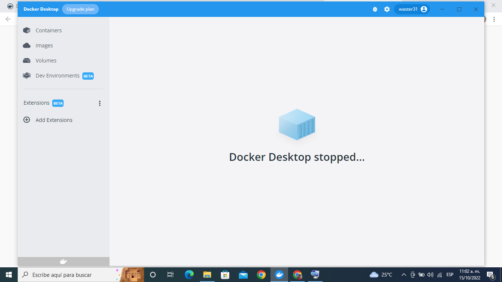
