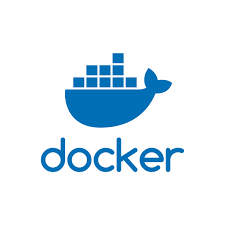
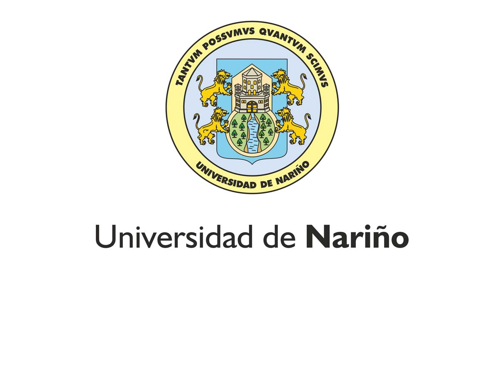

# TUTORIAL DE INSTALCION DE DOCKER 

1. [Definicion][Definicion]

[Definicion]:https://github.com/LuisKrlos27/Ducker_Compose/tree/main/Definicion

2. [Workflow][Workflow]

[Workflow]:https://github.com/LuisKrlos27/Ducker_Compose/tree/main/Workflow

3. [Comandos][Comandos]

[Comandos]:https://github.com/LuisKrlos27/Ducker_Compose/tree/main/Comandos

4. [Instalacion][Instalacion]

[Instalacion]:https://github.com/LuisKrlos27/Ducker_Compose/tree/main/Instalacion
## Lista de integrantes:

1. [Luis Carlos Escobar][Luis Carlos Escobar]

[Luis Carlos Escobar]:https://github.com/LuisKrlos27

2. [Jose Wastterson][Jose Wastterson]

[Jose Wastterson]:https://github.com/wastterson31

3. Michale Owen 

## Universidad de Nariño - sede Tumaco

